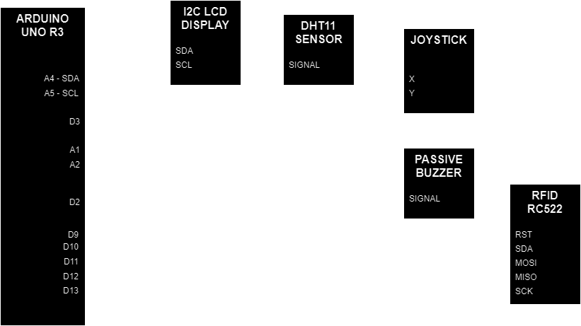

<h1 align="center">SCADA - Arduino Hardware</h1> 

### This project uses an Arduino Uno board to acquire and send data to a remote supervisory system. It was created for the purpose of study and technological improvement.

## What is SCADA?
A supervisory system, also known as SCADA (Supervisory Control and Data Acquisition), is a software and hardware system that enables the monitoring and control of large-scale industrial or infrastructure processes.

It collects real-time data from sensors and devices, processes and displays this information, allowing operators to make informed decisions and perform control actions.

## Related Projects
### [SCADA - Rust Supervisory](https://github.com/thiagoelias99/scada-supervisory-rust/tree/main)
Rust CLI supervisory used to monitor this project.

## Processes
1. **Humidity monitoring**: Uses a DHT11 sensor to acquire humidity data.
2. **Temperature monitoring**: Uses a DHT11 sensor to acquire temperature data.
3. **Analog joystick position monitoring**: Uses a resistive joystick to acquire X and Y position.
4. **RFID reader**: Uses a RC522 to read RF Tags ID.
5. **LCD monitor**: Implemented LCD I2C to monitor processes data.

## Block Diagram

## Roadmap
- **[X]** When the serial data is received from supervisory system, display it on the LCD for a brief moment.
- **[X]** Monitor humidity and temperature, display it on the LCD.
- **[X]** Serial send humidity and temperature.
- **[X]** Monitor joystick X | Y position, display it on the LCD.
- **[X]** Serial send joystick X | Y position.
- **[X]** When RFID tags is detected, display its id on the LCD for a brief moment.
- **[X]** Serial send tag Id.
- **[X]** Bip when serial data is received.
- **[X]** Bip when RFID tag is detected.

## Serial Communication Patterns
- **Humidity** (send): 
  - **44 48 48 55 (VALUE IN HEX)**
  - 44 48 48 55 3C -> 60%
  - 44 48 48 55 14 -> 20%
- **Temperature** (send): 
  - **44 48 54 45 (VALUE IN HEX)**
  - 44 48 54 45 19 -> 25%
  - 44 48 54 45 25 -> 37%
- **Joystick** (send): 
  - **4A 59 58 49 (X VALUE IN HEX) (Y VALUE IN HEX)**
  - 4A 59 58 49 1E 36 -> X=30 Y=70
  - 4A 59 58 49 32 00 -> X=50 Y=0
- **RFID** (send): 
  - **52 46 49 44 (ID IN HEX)**
  - 52 46 49 44 53 58 68 20 -> Tag ID = 83 88 104 32